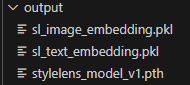

## Preferred IDE: VSCode


### Run the Stylelens app on local:

1. Install required dependencies on local:

  ```commandline
  pip install -r requirements.txt
  ```

2. Download images from google drive using script or manually 

  Make sure you have gdown installed on your machine. If not, please install it.
  ```
  pip install gdown -U --no-cache-dir
  ``` 

  Run script to download images
  ```
  python .\download_images.py
  ``` 
  Or you can download manually images using this link: https://drive.google.com/uc?id=1SlE6hs3mtc9Kh17gauHuWfELeUOMojPD&export=downloa


3. Make sure you're able to see 3 files under the output folder. If not, please go to the model section and generate all three files.

  

4. Test the streamlit app on local:
  ```
  streamlit run app.py
  ```

### Building the docker image

(Note: Run as administrator on Windows and remove "sudo" in commands)

5. Important - Make sure you have installed Docker on your PC:
- Linux: Docker
- Windows/Mac: Docker Desktop

6. Start Docker:
- Linux (Home Directory):
  ```
  sudo systemctl start docker
  ```
- Windows: You can start Docker engine from Docker Desktop.

7. Build Docker image from the project directory:

```commandline
sudo docker-compose build 
```

### Running the container 

8. Start a container:
```commandline
sudo docker-compose up        
```

9. This will display the URL to access the Streamlit app (http://0.0.0.0:8501). Note that this URL may not work on Windows. For Windows, go to http://localhost:8501/.


## Follow the steps below if you're not seeing the model and embedding files in the output folder

### Fine tune RestNet50 Model the Stylelens app on local:
1. Install required dependencies on local:

```commandline
pip install -r requirements.txt
```

2. Download images from google drive using script or manually 
Run script to download images
```
python .\download_images.py
``` 
Or you can download manually images using this link: https://drive.google.com/uc?id=1SlE6hs3mtc9Kh17gauHuWfELeUOMojPD&export=downloa


3. to train model locally:
```
python .\train.py    
```

4. create a Image Embedding and store in pickle file (sl_image_embedding.pkl):
```
python .\image-embedding.py     
```

5. create a Text Embedding and store in pickle file (sl_text_embedding.pkl):
```
python .\image-embedding.py     
```